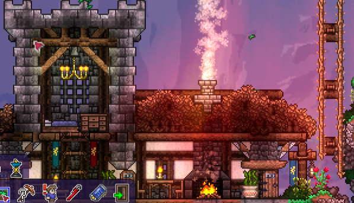
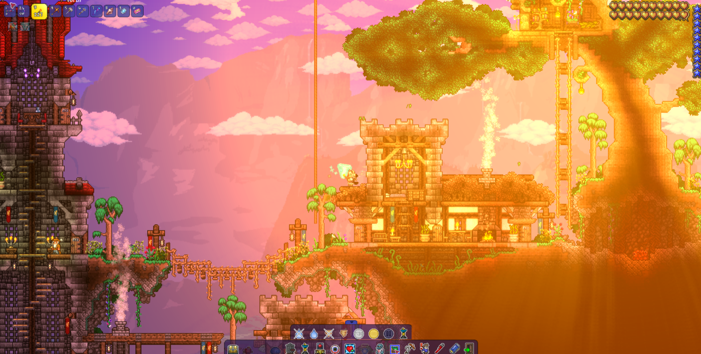

# TShader - A Dynamic Lighting & Post-Processing Engine for Terraria

```
        \   |   /
         '.-'-.`
      -- (  _  ) --
         ,`'-'`
        /   |   \
```

TShader is a high-performance, configurable post-processing mod for tModLoader that enhances Terraria's visuals with dynamic lighting, volumetric shadows (god rays), and adaptive bloom effects. It is designed to be a lightweight but powerful framework for rendering custom shader effects over the game screen.




---

## Table of Contents

1.  [**Features**](#features)
2.  [**Installation & Usage**](#installation--usage)
3.  [**Configuration**](#configuration)
4.  [**Technical Overview: The Shader Pipeline**](#technical-overview-the-shader-pipeline)
5.  [**Core Components**](#core-components)
6.  [**Shader Development Guide**](#shader-development-guide)
7.  [**Project Structure**](#project-structure)

---

## Features

-   **Dynamic Lighting:** A custom lighting engine that applies realistic color grading and tone mapping to create more atmospheric scenes, day and night.
-   **Volumetric Shadows (God Rays):** Realistic light-shaft effects that emanate from the sun/moon, creating a sense of depth and atmosphere.
-   **Adaptive Bloom:** An intelligent bloom effect that adds a soft glow to light sources. The effect's intensity and color adapt to the time of day, player location, and on-screen light sources.
-   **High Configurability:** Key visual parameters can be easily tweaked directly in the source code to customize the look and feel.

---

## Installation & Usage

### For Players

1.  Download TShader from the Steam Workshop or the in-game Mod Browser.
2.  Enable the mod from the "Mods" menu in tModLoader.
3.  The visual effects will be active automatically in-game.

### For Developers

1.  Clone or download the source code for this project.
2.  Place the entire `TShader` folder into your tModLoader ModSources directory.
    -   Default Path: `C:\Users\[Your_Username]\OneDrive\Documents\My Games\Terraria\tModLoader\ModSources\`
3.  Open Terraria with tModLoader and go to the "Workshop" -> "Develop Mods" menu.
4.  Click "Build" or "Build + Reload" to compile the mod.
5.  Once built, you can enable it from the "Mods" menu like any other mod.

---

## Configuration

To adjust the shader's behavior, you can modify the public static variables at the top of `TShader/TShader.cs` and recompile the mod.

| Variable | Type | Default | Description |
| :--- | :--- | :--- | :--- |
| `useLight` | `bool` | `true` | Master switch for the entire lighting and shadow system. |
| `useBloom` | `bool` | `true` | Master switch for the bloom (glow) effect. |
| `lightIntensity` | `float` | `1.05f` | Multiplier for the overall brightness and color intensity during the day. |
| `shadowIntensity` | `float` | `1f` | Controls the darkness/prominence of the volumetric shadows. |
| `bloomIntensity` | `float` | `0.75f` | Multiplier for the strength and spread of the bloom effect. |
| `moonLightIntensity` | `float` | `0.85f` | Multiplier for the ambient light intensity during the night. |
| `quality` | `int` | `32` | Controls the number of samples for the shadow effect. Higher values produce smoother god rays at a performance cost. |

---

## Technical Overview: The Shader Pipeline

TShader works by intercepting Terraria's final render call. Instead of the game drawing directly to the screen, TShader takes the rendered scene and processes it through a series of full-screen shader effects, called "passes". Each pass adds a layer of visual enhancement before the final, modified image is presented to the player.

The execution flow is as follows:

**Game Renders Scene** -> **TShader Intercepts** -> **Bloom Pass** -> **Lighting Pass** -> **Shadow Pass** -> **Final Image to Screen**

---

## Core Components

The mod's logic is separated into several key components to keep the code organized and maintainable.

| Class / Component | Role |
| :--- | :--- |
| `TShader.cs` | **Main Mod Class.** Handles loading/unloading, event hooking (intercepting the render pipeline), and holds the public configuration settings. |
| `ShaderManager.cs` | **Pipeline Orchestrator.** Manages the list of shader passes and executes them in the correct order each frame. It creates a `ShaderContext` object containing necessary frame data (like sun position) to pass to each effect. |
| `ResourceCache.cs` | **Asset Management.** Loads, stores, and disposes all necessary assets: `Effect` (shaders), `Texture2D` (color lookup tables), and `RenderTarget2D` (off-screen buffers for processing). Ensures graphics resources are handled safely. |
| `IShaderPass` | **The Pass Interface.** A contract that defines what each step in the pipeline must do. The primary method is `Execute()`, which applies the shader effect. |
| `BloomPass.cs` | Implements the adaptive bloom effect. Extracts bright areas of the screen and applies a beautiful, configurable glow. |
| `LightingPass.cs` | Implements the dynamic lighting system. Applies color grading and tone mapping, and calculates the position and intensity of dynamic light sources (like torches). |
| `ShadowPass.cs` | Implements the volumetric shadow effect. Uses the lighting information to create "god ray" light shafts. |
| `ShaderConstants.cs` | A centralized static class holding "magic numbers" and constants used across multiple shaders and C# files, making them easy to tweak. |

---

## Shader Development Guide

The raw shader code is written in **HLSL (High-Level Shading Language)** and stored in `.fx` files. For Terraria to use them, they must be compiled into a binary `.xnb` format.

### Workflow

1.  **Navigate to the Effects Directory:**
    -   `TShader/Effects/`

2.  **Edit the Shader Source:**
    -   Open a `.fx` file (e.g., `Bloom.fx`, `Light.fx`, `Shadow.fx`) in a text editor or IDE to modify the shader logic.

3.  **Compile the Shader:**
    -   Run the `fxcompiler.exe` executable located in the `Effects` directory.
    -   This compiler will automatically find all `.fx` files and compile them into corresponding `.xnb` files (e.g., `Bloom.fx` -> `Bloom.xnb`).

4.  **Reload the Mod:**
    -   The game automatically uses the new `.xnb` files. Simply reload the mod in-game (or restart the game) to see your changes.

---

## Project Structure

| Directory | Purpose |
| :--- | :--- |
| `/` | Contains the main mod file (`TShader.cs`), project files (`.csproj`, `.sln`), and build properties. |
| `/Core/` | Contains the central management classes: `ShaderManager`, `ResourceCache`, `ShaderConstants`, etc. |
| `/Effects/` | Contains the HLSL shader source (`.fx`), the compiled shader assets (`.xnb`), and the compiler (`fxcompiler.exe`). |
| `/Passes/` | Contains the C# logic for each individual step in the shader pipeline (`BloomPass`, `LightingPass`, etc.). |
| `/Properties/` | Standard Visual Studio folder containing assembly information. |
| `/Localization/` | Contains text localization files for different languages. |